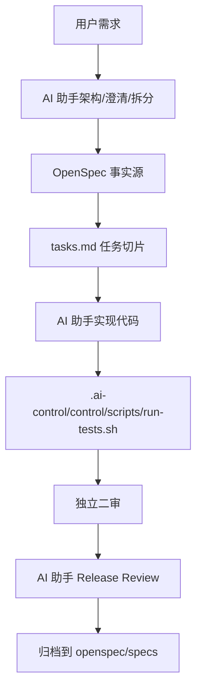
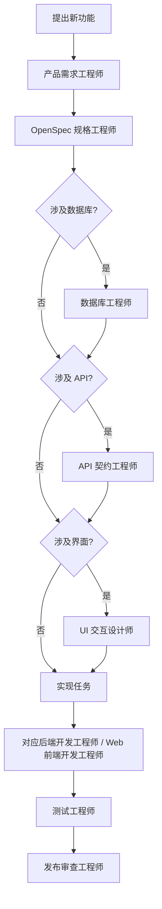
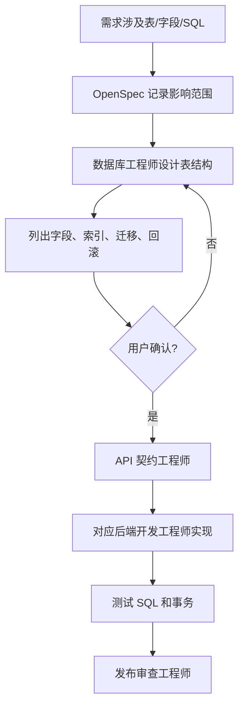
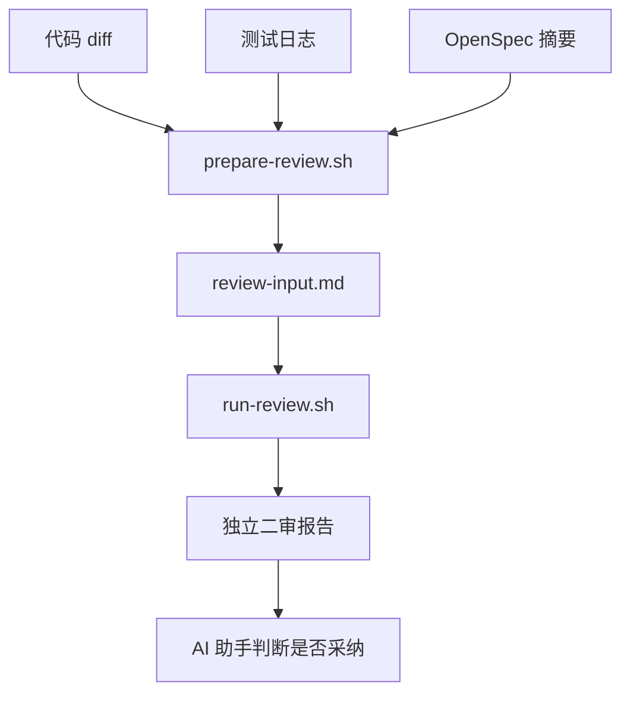
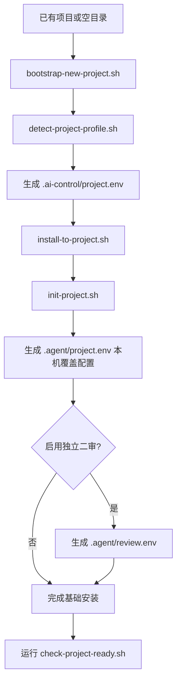
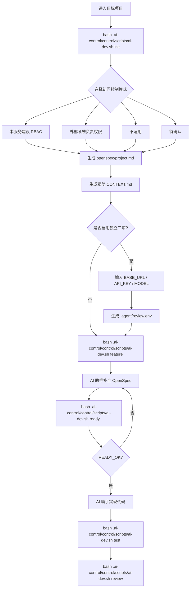

# AI 全栈控制系统流程图

## 总体关系

```mermaid
flowchart TD
  U["用户需求"] --> C["AI 助手架构/澄清/拆分"]
  C --> O["OpenSpec 事实源"]
  O --> T["tasks.md 任务切片"]
  T --> I["AI 助手实现代码"]
  I --> R[".ai-control/control/scripts/run-tests.sh"]
  R --> D["独立二审"]
  D --> CR["AI 助手 Release Review"]
  CR --> A["归档到 openspec/specs"]
```

## 新功能流程

```mermaid
flowchart TD
  A["提出新功能"] --> B["产品需求工程师"]
  B --> C["OpenSpec 规格工程师"]
  C --> D{"涉及数据库?"}
  D -- "是" --> E["数据库工程师"]
  D -- "否" --> F{"涉及 API?"}
  E --> F
  F -- "是" --> G["API 契约工程师"]
  F -- "否" --> H{"涉及界面?"}
  G --> H
  H -- "是" --> I["UI 交互设计师"]
  H -- "否" --> J["实现任务"]
  I --> J
  J --> K["对应后端开发工程师 / Web 前端开发工程师"]
  K --> L["测试工程师"]
  L --> M["发布审查工程师"]
```

## 数据库变更流程

```mermaid
flowchart TD
  A["需求涉及表/字段/SQL"] --> B["OpenSpec 记录影响范围"]
  B --> C["数据库工程师设计表结构"]
  C --> D["列出字段、索引、迁移、回滚"]
  D --> E{"用户确认?"}
  E -- "否" --> C
  E -- "是" --> F["API 契约工程师"]
  F --> G["对应后端开发工程师实现"]
  G --> H["测试 SQL 和事务"]
  H --> I["发布审查工程师"]
```

## 独立二审流程

```mermaid
flowchart TD
  A["代码 diff"] --> B["prepare-review.sh"]
  C["测试日志"] --> B
  D["OpenSpec 摘要"] --> B
  B --> E["review-input.md"]
  E --> F["run-review.sh"]
  F --> G["独立二审报告"]
  G --> H["AI 助手判断是否采纳"]
```

## 新项目接入流程

```mermaid
flowchart TD
  A["已有项目或空目录"] --> B["bootstrap-new-project.sh"]
  B --> C["detect-project-profile.sh"]
  C --> D["生成 .ai-control/project.env"]
  D --> E["install-to-project.sh"]
  E --> F["init-project.sh"]
  F --> G["生成 .agent/project.env 本机覆盖配置"]
  G --> H{"启用独立二审?"}
  H -- "是" --> I["生成 .agent/review.env"]
  H -- "否" --> J["完成基础安装"]
  I --> J
  J --> K["运行 check-project-ready.sh"]
```

## 小白使用流程

```mermaid
flowchart TD
  A["进入目标项目"] --> B["bash .ai-control/control/scripts/ai-dev.sh init"]
  B --> C{"选择访问控制模式"}
  C --> C1["本服务建设 RBAC"]
  C --> C2["外部系统负责权限"]
  C --> C3["不适用"]
  C --> C4["待确认"]
  C1 --> D["生成 openspec/project.md"]
  C2 --> D
  C3 --> D
  C4 --> D
  D --> E["生成精简 CONTEXT.md"]
  E --> F{"是否启用独立二审?"}
  F -- "是" --> F1["输入 BASE_URL / API_KEY / MODEL"]
  F1 --> F2["生成 .agent/review.env"]
  F -- "否" --> G["bash .ai-control/control/scripts/ai-dev.sh feature <change-id>"]
  F2 --> G
  G --> H["AI 助手补全 OpenSpec"]
  H --> I["bash .ai-control/control/scripts/ai-dev.sh ready <change-id>"]
  I --> J{"READY_OK?"}
  J -- "否" --> H
  J -- "是" --> K["AI 助手实现代码"]
  K --> L["bash .ai-control/control/scripts/ai-dev.sh test"]
  L --> M["bash .ai-control/control/scripts/ai-dev.sh review"]
```
